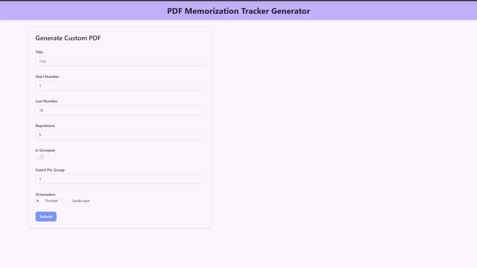

# PDF Memorization Tracker Generator

This is a simple tool that generates a PDF Memorization Tracker using React and TypeScript. This tools allows users to create PDF documents that help them track their memorization progress.

## Live Demo

You can view the live demo of the project [here](https://pdf-memorization-tracker-generator.onrender.com).

## Technologies Used

- React
- TypeScript
- Vite
- Tailwind CSS
- [ShadCn UI](https://ui.shadcn.com/)
- [JsPDF](https://www.npmjs.com/package/jspdf)
- [Zod](https://zod.dev/)
- [React Hook Form](https://react-hook-form.com/)

## Demo



## How to Run

1. Clone the repository

   ```bash
   git clone https://github.com/asmaahamid02/pdf-memorization-tracker-generator.git
   cd pdf-memorization-tracker-generator
   ```

2. Install dependencies

   ```bash
   npm install
   ```

3. Start the development server

   ```bash
   npm run dev
   ```
